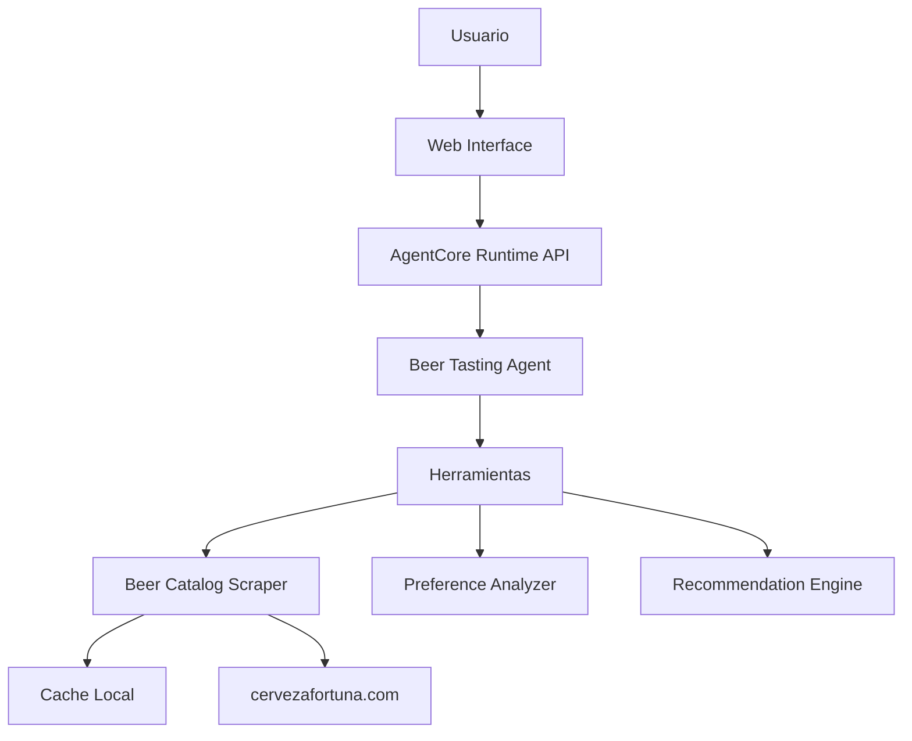
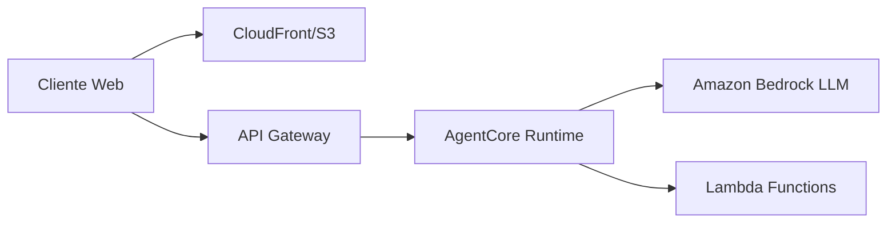

# Design Document

## Overview

El Beer Tasting Agent es un agente conversacional construido con Strands Agents que asiste a usuarios durante catas de cerveza. El sistema utiliza un único agente especializado que combina capacidades de scraping web, análisis de preferencias, y generación de recomendaciones personalizadas. El agente se despliega en Amazon Bedrock AgentCore Runtime para aprovechar la infraestructura serverless de AWS, y se consume a través de una interfaz web simple construida con HTML/JavaScript que se comunica con el endpoint del agente.

### Arquitectura de Alto Nivel

El sistema consta de tres componentes principales:

1. **Beer Tasting Agent**: Agente Strands con herramientas especializadas para scraping, análisis y recomendaciones
2. **AgentCore Runtime**: Plataforma de despliegue serverless que expone el agente como API
3. **Web Interface**: Interfaz de usuario simple para interactuar con el agente

## Architecture

### Component Diagram



### Deployment Architecture



## Components and Interfaces

### 1. Beer Tasting Agent

**Responsabilidad**: Orquestar la conversación de cata y coordinar las herramientas

**Implementación**:
- Framework: Strands Agents SDK
- Modelo: Amazon Bedrock (Claude Sonnet 4.5)
- Patrón: Agente único con múltiples herramientas

**Configuración del Agente**:
```python
from strands import Agent
from tools import (
    get_beer_catalog,
    get_beer_details,
    analyze_preferences,
    predict_favorite,
    suggest_tasting_order,
    get_food_pairing
)

agent = Agent(
    name="Beer Tasting Cicerone",
    instructions="""Eres un experto cicerone de cerveza que asiste a usuarios durante catas.
    Tu objetivo es:
    1. Guiar al usuario a través de la evaluación de cada cerveza
    2. Educar sobre estilos, ingredientes y procesos
    3. Predecir qué cerveza será su favorita basándote en sus preferencias
    4. Proporcionar recomendaciones de maridaje
    
    Mantén un tono amigable, educativo y entusiasta sobre la cerveza artesanal.""",
    tools=[
        get_beer_catalog,
        get_beer_details,
        analyze_preferences,
        predict_favorite,
        suggest_tasting_order,
        get_food_pairing
    ]
)
```

### 2. Herramientas del Agente

#### 2.1 Beer Catalog Scraper

**Función**: `get_beer_catalog() -> List[Beer]`

**Descripción**: Obtiene el catálogo completo de cervezas desde cervezafortuna.com

**Implementación**:
- Librería: `requests` + `BeautifulSoup4`
- Cache: Almacenamiento local con TTL de 24 horas
- Manejo de errores: Fallback a datos cacheados si el sitio no está disponible

**Estructura de Datos**:
```python
@dataclass
class Beer:
    id: str
    name: str
    style: str
    abv: float  # Alcohol by Volume
    ibu: Optional[int]  # International Bitterness Units
    description: str
    image_url: Optional[str]
```

#### 2.2 Beer Details Tool

**Función**: `get_beer_details(beer_id: str) -> BeerDetails`

**Descripción**: Obtiene información detallada de una cerveza específica

**Retorna**: Información extendida incluyendo notas de cata, ingredientes, y proceso de elaboración

#### 2.3 Preference Analyzer

**Función**: `analyze_preferences(session_data: dict) -> PreferenceProfile`

**Descripción**: Analiza las respuestas del usuario durante la cata para construir un perfil de preferencias

**Lógica**:
- Extrae características mencionadas positivamente (ej: "me gusta el amargor")
- Identifica patrones en estilos preferidos
- Pondera características por intensidad de la respuesta

**Estructura**:
```python
@dataclass
class PreferenceProfile:
    preferred_styles: List[str]
    bitterness_preference: str  # "low", "medium", "high"
    alcohol_tolerance: str  # "light", "moderate", "strong"
    flavor_notes: List[str]  # ["citrus", "caramel", "coffee", etc.]
    body_preference: str  # "light", "medium", "full"
```

#### 2.4 Favorite Predictor

**Función**: `predict_favorite(profile: PreferenceProfile, available_beers: List[Beer]) -> List[Tuple[Beer, float]]`

**Descripción**: Predice qué cervezas serán las favoritas del usuario basándose en su perfil

**Algoritmo**:
1. Calcular score de compatibilidad para cada cerveza
2. Ponderar por características del perfil
3. Retornar ranking ordenado con scores de confianza

#### 2.5 Tasting Order Suggester

**Función**: `suggest_tasting_order(beers: List[Beer]) -> List[Beer]`

**Descripción**: Sugiere el orden óptimo de degustación

**Lógica**:
- Ordenar de menor a mayor ABV
- Considerar intensidad de sabor (IBU)
- Agrupar estilos similares

#### 2.6 Food Pairing Tool

**Función**: `get_food_pairing(beer: Beer) -> List[FoodPairing]`

**Descripción**: Sugiere maridajes de comida para una cerveza

**Base de Conocimiento**: Reglas predefinidas basadas en estilo de cerveza

### 3. AgentCore Runtime Integration

**Archivo**: `app.py`

**Implementación**:
```python
from bedrock_agentcore.runtime import BedrockAgentCoreApp
from agent import agent

app = BedrockAgentCoreApp()

@app.entrypoint
def agent_invocation(payload, context):
    """Handler principal para invocaciones del agente"""
    user_message = payload.get("prompt", "")
    session_id = payload.get("session_id", "default")
    
    # Recuperar o inicializar estado de sesión
    session_state = get_session_state(session_id)
    
    # Invocar agente con estado
    result = agent(
        user_message,
        session_id=session_id,
        session_state=session_state
    )
    
    # Guardar estado actualizado
    save_session_state(session_id, result.state)
    
    return {
        "response": result.message,
        "session_id": session_id
    }

app.run()
```

### 4. Web Interface (Streamlit)

**Tecnologías**: Streamlit

**Componentes**:
- Chat interface usando `st.chat_message` y `st.chat_input`
- Historial de mensajes en `st.session_state`
- Botón para iniciar nueva sesión en sidebar
- Indicador de estado mientras el agente procesa

**Implementación**:
```python
import streamlit as st
import requests

st.title("🍺 Beer Tasting Cicerone")

# Inicializar session state
if "messages" not in st.session_state:
    st.session_state.messages = []
if "session_id" not in st.session_state:
    st.session_state.session_id = str(uuid.uuid4())

# Sidebar con controles
with st.sidebar:
    if st.button("Nueva Sesión"):
        st.session_state.messages = []
        st.session_state.session_id = str(uuid.uuid4())
        st.rerun()

# Mostrar historial de mensajes
for message in st.session_state.messages:
    with st.chat_message(message["role"]):
        st.markdown(message["content"])

# Input del usuario
if prompt := st.chat_input("Escribe tu mensaje..."):
    # Agregar mensaje del usuario
    st.session_state.messages.append({"role": "user", "content": prompt})
    with st.chat_message("user"):
        st.markdown(prompt)
    
    # Llamar al agente
    with st.chat_message("assistant"):
        with st.spinner("Pensando..."):
            response = requests.post(
                AGENTCORE_ENDPOINT,
                json={
                    "prompt": prompt,
                    "session_id": st.session_state.session_id
                }
            )
            assistant_response = response.json()["response"]
            st.markdown(assistant_response)
    
    # Agregar respuesta del asistente
    st.session_state.messages.append({"role": "assistant", "content": assistant_response})
```

## Data Models

### Session State

```python
@dataclass
class TastingSession:
    session_id: str
    user_id: Optional[str]
    started_at: datetime
    beers_tasted: List[str]  # IDs de cervezas probadas
    evaluations: Dict[str, BeerEvaluation]
    preference_profile: Optional[PreferenceProfile]
    conversation_history: List[Message]
```

### Beer Evaluation

```python
@dataclass
class BeerEvaluation:
    beer_id: str
    appearance_notes: Optional[str]
    aroma_notes: Optional[str]
    taste_notes: Optional[str]
    mouthfeel_notes: Optional[str]
    overall_rating: Optional[int]  # 1-5
    timestamp: datetime
```

### Message

```python
@dataclass
class Message:
    role: str  # "user" o "assistant"
    content: str
    timestamp: datetime
```


## Correctness Properties

*A property is a characteristic or behavior that should hold true across all valid executions of a system-essentially, a formal statement about what the system should do. Properties serve as the bridge between human-readable specifications and machine-verifiable correctness guarantees.*

### Property 1: Beer information completeness
*For any* beer ID in the catalog, when requesting beer information, the response should contain all required fields: name, style, ABV, IBU, and description.
**Validates: Requirements 1.1**

### Property 2: Catalog listing completeness
*For any* request to list available beers, all returned beers should have basic information fields populated (name, style, ABV).
**Validates: Requirements 1.3**

### Property 3: Preference recording
*For any* user feedback on a beer characteristic, that feedback should be stored in the Preference Profile for the current session.
**Validates: Requirements 2.3, 8.1**

### Property 4: Tasting progression ordering
*For any* set of beers in a tasting session, when suggesting the next beer after completing one, the suggested beer should have equal or higher intensity (measured by ABV or IBU) than the current beer.
**Validates: Requirements 2.4**

### Property 5: Preference analysis trigger
*For any* tasting session, after evaluating at least two beers, the preference analysis function should be invoked and return a valid PreferenceProfile.
**Validates: Requirements 3.1**

### Property 6: Prediction reasoning
*For any* prediction made by the agent, the explanation should reference at least one element from the user's PreferenceProfile.
**Validates: Requirements 3.2, 3.4**

### Property 7: Complete beer ranking
*For any* set of beers tasted, when generating a final ranking, all tasted beers should appear exactly once in the ranking.
**Validates: Requirements 3.3**

### Property 8: Educational response provision
*For any* valid beer style query, the agent should provide a non-empty explanation containing style characteristics.
**Validates: Requirements 4.1, 4.3**

### Property 9: Food pairing minimum suggestions
*For any* beer in the catalog, when requesting food pairings, the system should return at least three food suggestions.
**Validates: Requirements 5.1**

### Property 10: Pairing explanation inclusion
*For any* food pairing suggestion, the response should include an explanation of why the pairing works.
**Validates: Requirements 5.2**

### Property 11: Reverse pairing validity
*For any* food preference mentioned, recommended beers should all exist in the Beer Catalog.
**Validates: Requirements 5.3**

### Property 12: Response time constraint
*For any* user message under normal conditions, the agent should respond within 5 seconds.
**Validates: Requirements 6.2**

### Property 13: Preference consistency
*For any* active tasting session, preferences stored in the profile should not contain contradictory statements (e.g., both "likes bitter" and "dislikes bitter").
**Validates: Requirements 8.4**

### Property 14: Recommendation preference alignment
*For any* recommendation made, at least one characteristic of the recommended beer should match a preference in the user's PreferenceProfile.
**Validates: Requirements 8.2**

### Property 15: Invalid input handling
*For any* invalid user input, the agent should respond with a clarification request and maintain the conversation state without termination.
**Validates: Requirements 9.2**

### Property 16: Error logging and messaging
*For any* unexpected error, the system should both log the error details and provide a user-friendly message to the user.
**Validates: Requirements 9.3**

### Property 17: State recovery after error
*For any* error that occurs during a session, after recovery, the session state should match the last valid state before the error.
**Validates: Requirements 9.4**

## Error Handling

### Error Categories

#### 1. External Service Errors
- **Website Unavailable**: Cuando cervezafortuna.com no responde
  - Estrategia: Usar datos cacheados con advertencia al usuario
  - Timeout: 10 segundos para requests HTTP
  - Retry: 2 intentos con backoff exponencial

#### 2. Data Validation Errors
- **Invalid Beer Data**: Datos incompletos o malformados del scraping
  - Estrategia: Omitir cervezas con datos inválidos, registrar warning
  - Validación: Verificar campos requeridos antes de agregar al catálogo

#### 3. User Input Errors
- **Ambiguous Input**: Usuario proporciona información poco clara
  - Estrategia: Solicitar clarificación manteniendo contexto
  - Ejemplo: "No estoy seguro a qué cerveza te refieres. ¿Podrías ser más específico?"

#### 4. Session State Errors
- **Corrupted Session**: Estado de sesión inválido o corrupto
  - Estrategia: Inicializar nueva sesión, informar al usuario
  - Logging: Registrar estado corrupto para debugging

#### 5. Model Errors
- **LLM Timeout**: El modelo tarda demasiado en responder
  - Estrategia: Timeout de 30 segundos, mensaje de disculpa al usuario
  - Retry: 1 intento adicional con prompt simplificado

### Error Response Format

```python
@dataclass
class ErrorResponse:
    error_type: str
    user_message: str
    technical_details: Optional[str]
    recovery_action: str
    timestamp: datetime
```

### Logging Strategy

- **Level INFO**: Operaciones normales (inicio de sesión, scraping exitoso)
- **Level WARNING**: Errores recuperables (cache usado, datos parciales)
- **Level ERROR**: Errores que afectan funcionalidad (scraping fallido, modelo no responde)
- **Level CRITICAL**: Errores que impiden operación (AgentCore no disponible)

## Testing Strategy

### Unit Testing

**Framework**: pytest

**Cobertura**:
- Funciones de scraping con datos mock
- Lógica de análisis de preferencias
- Algoritmos de ranking y predicción
- Funciones de validación de datos
- Manejo de errores específicos

**Ejemplo**:
```python
def test_beer_catalog_scraper_with_mock():
    """Test que el scraper parsea correctamente HTML mock"""
    mock_html = "<html>...</html>"
    result = parse_beer_catalog(mock_html)
    assert len(result) > 0
    assert all(beer.name for beer in result)
```

### Property-Based Testing

**Framework**: Hypothesis (Python)

**Configuración**: Mínimo 100 iteraciones por propiedad

**Estrategia**:
- Generar datos aleatorios de cervezas, preferencias y sesiones
- Verificar que las propiedades de corrección se mantienen
- Usar estrategias de generación inteligentes (ej: ABV entre 3-15%)

**Ejemplo**:
```python
from hypothesis import given, strategies as st

@given(
    beers=st.lists(beer_strategy(), min_size=2, max_size=10),
    preferences=preference_profile_strategy()
)
def test_property_7_complete_ranking(beers, preferences):
    """Property 7: Complete beer ranking
    
    Feature: beer-tasting-agent, Property 7: Complete beer ranking
    Validates: Requirements 3.3
    """
    ranking = generate_ranking(beers, preferences)
    
    # Todos los beers deben aparecer exactamente una vez
    assert len(ranking) == len(beers)
    assert set(ranking) == set(beers)
```

### Integration Testing

**Alcance**:
- Integración entre agente y herramientas
- Flujo completo de sesión de cata
- Comunicación con AgentCore Runtime

**Herramientas**: pytest con fixtures para estado compartido

### End-to-End Testing

**Alcance**:
- Flujo completo desde Web Interface hasta respuesta del agente
- Verificación de persistencia de sesión
- Pruebas de múltiples usuarios concurrentes

**Herramientas**: Playwright o Selenium para UI, requests para API

## Technology Stack

### Backend
- **Framework de Agente**: Strands Agents SDK
- **Modelo LLM**: Amazon Bedrock - Claude Sonnet 4.5 (us.anthropic.claude-sonnet-4-5-20250929-v1:0)
- **Runtime**: Amazon Bedrock AgentCore
- **Web Scraping**: requests + BeautifulSoup4
- **Lenguaje**: Python 3.13
- **Testing**: pytest + Hypothesis
- **Dependencias adicionales**: uuid, dataclasses

### Frontend
- **UI Framework**: Streamlit
- **HTTP Client**: requests
- **Hosting**: Amazon ECS/Fargate o EC2
- **Dependencias**: streamlit, requests, uuid

### Infrastructure
- **Deployment**: AWS CDK o Terraform
- **API Gateway**: Amazon API Gateway
- **Storage**: Amazon S3 (para cache y assets)
- **Monitoring**: Amazon CloudWatch

## Deployment

### Local Development

```bash
# Instalar dependencias
pip install strands-agents bedrock-agentcore-runtime requests beautifulsoup4

# Configurar variables de entorno
export AWS_REGION=us-east-1
export BEDROCK_MODEL_ID=us.anthropic.claude-sonnet-4-5-20250929-v1:0

# Ejecutar localmente
python app.py
```

### AgentCore Deployment

```bash
# Empaquetar aplicación
zip -r agent.zip app.py agent.py tools/ requirements.txt

# Desplegar a AgentCore usando CLI
aws bedrock-agentcore deploy \
  --agent-name beer-tasting-agent \
  --runtime-zip agent.zip \
  --model-id us.anthropic.claude-sonnet-4-5-20250929-v1:0
```

### Web Interface Deployment

```bash
# Ejecutar Streamlit localmente
streamlit run app_ui.py

# O desplegar en ECS/Fargate
docker build -t beer-tasting-ui .
docker push <ecr-repo>/beer-tasting-ui:latest
# Desplegar usando ECS task definition
```

## Security Considerations

1. **API Authentication**: Implementar API keys o AWS IAM para acceso al endpoint
2. **Rate Limiting**: Limitar requests por usuario para prevenir abuso
3. **Input Sanitization**: Validar y sanitizar todo input del usuario
4. **Data Privacy**: No almacenar información personal identificable sin consentimiento
5. **HTTPS**: Todas las comunicaciones deben usar TLS/SSL

## Performance Considerations

1. **Caching**: Cache de catálogo de cervezas con TTL de 24 horas
2. **Lazy Loading**: Cargar detalles de cerveza solo cuando se solicitan
3. **Async Operations**: Usar operaciones asíncronas para scraping
4. **Connection Pooling**: Reutilizar conexiones HTTP
5. **Response Streaming**: Considerar streaming de respuestas largas del LLM

## Future Enhancements

1. **Multi-idioma**: Soporte para inglés y otros idiomas
2. **Historial Persistente**: Guardar sesiones en DynamoDB para acceso futuro
3. **Comparación de Cervezas**: Herramienta para comparar dos cervezas lado a lado
4. **Integración con Redes Sociales**: Compartir resultados de cata
5. **Recomendaciones Colaborativas**: Usar datos de múltiples usuarios para mejorar predicciones
6. **Modo Experto**: Nivel avanzado con terminología técnica más detallada
